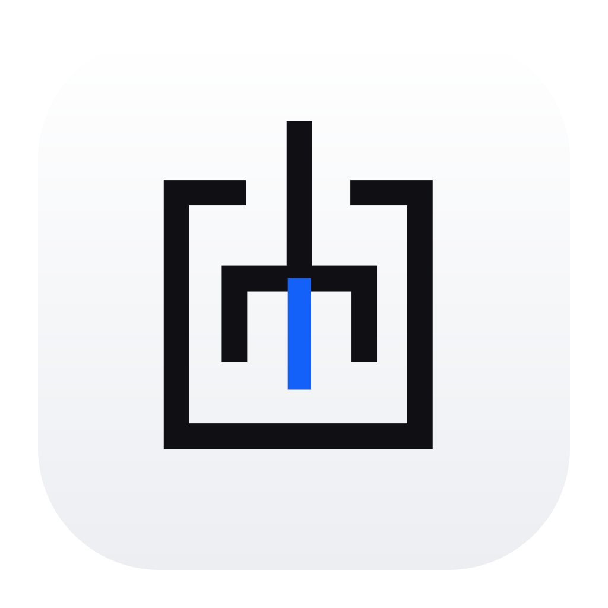
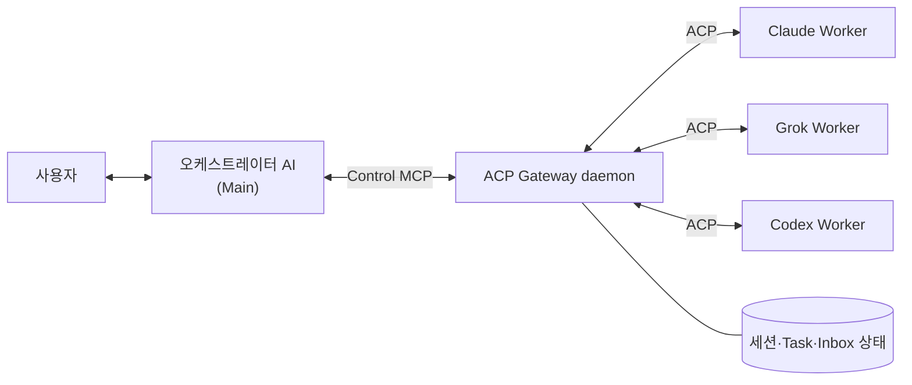

<p align="center">
  
</p>

<h1 align="center">AgenLynk</h1>

<p align="center">
  <b>0.4.0 Beta 2</b>
</p>

<p align="center">
  여러 AI 에이전트가 무엇을 하고 있는지 한 화면에서 지켜보는 <b>macOS 메뉴바 모니터링 앱</b>
</p>

<p align="center">
  
  
  
  
</p>

---

Claude에게 물어봤다가, Codex로 코드를 고치고, Grok에게 리뷰를 맡기다 보면 — 지금 어떤 에이전트가 무슨 일을 하고 있는지 놓치기 쉽습니다.

**AgenLynk**는 로컬에서 도는 AI 에이전트들과, 한 에이전트가 다른 에이전트에게 위임한 작업까지 실시간으로 보여주는 macOS 앱입니다. 내부에는 여러 AI를 ACP로 발견·실행·관리하는 **ACP Gateway** 런타임이 함께 들어 있습니다.

## 다운로드

### 1. DMG로 설치 (권장)

[**Releases 페이지**](https://github.com/creverse-ai-lab/agenlynk/releases)에서 최신 `AgenLynk.dmg`를 내려받아 `AgenLynk.app`을 **Applications 폴더로** 옮긴 뒤 실행하세요.

현재 테스트 배포 버전은 **[0.4.0 Beta 2](https://github.com/creverse-ai-lab/AgenLynk/releases/tag/v0.4.0-beta.2)**입니다. 정식 배포 전 베타 버전이므로 테스트 용도로 사용하세요.

- 최초 실행 시 대시보드 대신 **설치 화면**이 먼저 뜹니다. 대화용 Frontdoor(Codex / Claude / Grok)를 하나 이상 골라 설치하면, 앱이 번들된 Gateway 런타임을 `~/.acp-gateway/`에 설치·검증한 뒤 모니터링을 시작합니다.
- 시스템에 별도로 Node를 깔 필요가 없습니다. 필요한 Node 22 런타임이 앱에 포함돼 있습니다.
- 서명은 ad-hoc이므로 다른 Mac에서 처음 열 때 Gatekeeper 경고가 나올 수 있습니다. `우클릭 → 열기`로 실행하세요.

> Apple Silicon(arm64) · macOS 14(Sonoma) 이상

### 2. 소스에서 직접 빌드 (clone)

```bash
git clone https://github.com/creverse-ai-lab/agenlynk.git
cd agenlynk
npm ci

# 개발용 빠른 빌드 (번들 Node 없이 시스템 Node 사용)
npm run macos:build && npm run macos:run

# 배포용 DMG (번들 Node 포함 + 검증)
npm run macos:dmg      # build/AgenLynk.dmg 생성
npm run macos:verify   # 서명·런타임 인벤토리·번들 Node 실행 검증
```

## 무엇을 보여주나요

- **대시보드 시퀀스 다이어그램** — Frontdoor(작업 폴더명 또는 직접 지정한 이름)에서 Worker로 뻗어 나가는 **호출**과 다시 돌아오는 **응답**을 하나의 시간축 위에 표시합니다. 아직 응답하지 않은 호출은 한눈에 구분됩니다.
- **선택 에이전트 활동** — 클릭한 에이전트가 지금 *무엇을 하는지*(도구 실행 중 · 사고 중 · 답변 생성 중 · 권한 대기 …)를 상태 대신 앞세워 보여줍니다.
- **메뉴바 팝오버** — 실행 중인 세션의 라이브 그래프와, 데스크톱을 떠다니는 Pet 오버레이.
- **응답 본문 우선** — 이벤트 상세는 JSON 껍데기가 아니라 실제로 받은 텍스트를 먼저 보여주고, 원본 JSON은 접이식으로 둡니다. 조각으로 나뉘어 들어온 스트림 응답은 합쳐서 표시합니다.

## 두 가지 모니터링 경로

| | 감지 방법 | MCP 필요? | 보이는 것 |
|---|---|:---:|---|
| **로컬 스캐너** | Codex/Claude/Grok/Orca의 트랜스크립트를 감시 | ❌ | 단독 실행 세션(Frontdoor) |
| **Control MCP** | 에이전트를 Gateway로 태움 | ✅ | 위임(delegation)·Worker·서브에이전트·실시간 이벤트 |

단독으로 도는 에이전트는 MCP 없이도 보입니다. **위임 관계와 워커까지** 온전히 추적하려면 설정 → *ACP 연결* → **Frontdoor MCP 설치**에서 해당 에이전트를 추가하세요(이미 설치된 것은 "설치됨"으로 표시됩니다).

## 설정

macOS 표준 설정 창에서:

- **Gateway 구성** — 지원 런타임 옵션 전체를 한국어·영어로 함께 설명. 보존 기간·주기 값은 밀리초가 아니라 일·시간·분·초 등 자연 단위로 입력합니다. 보존 기간을 줄이면 삭제 확인을 받습니다.
- **ACP 연결** — 공식 ACP registry의 Worker 어댑터 설치/On·Off, 그리고 Frontdoor MCP 추가 설치.
- **버전·업데이트** — 설치된 Gateway 런타임 버전 확인, 앱에 포함된 런타임으로 업데이트, 이전 버전으로 롤백.
- **Pet** — 데스크톱 Pet 오버레이 On/Off.

앱을 업데이트하면 포함된 런타임이 기존 설치보다 새로울 때 자동으로 교체되고(더 오래된 것으로 되돌아가지 않음), 교체 전 실행 가능 여부를 검사하며 롤백 대상을 남깁니다.

---

## 엔진: ACP Gateway

AgenLynk가 위임을 추적할 수 있는 것은 내부의 **ACP Gateway** 덕분입니다. 사용자가 대화하는 AI(**오케스트레이터 / Main**)가 로컬의 여러 AI **Worker**를 발견·실행하고, 장기 작업·권한 요청·결과 회수까지 관리하는 미들웨어입니다.

- ACP 세션과 provider 프로세스를 daemon이 계속 유지합니다.
- MCP가 재시작되어도 Worker 세션을 복구할 수 있습니다.
- 모델·권한·질문·취소·결과 수집을 오케스트레이터가 통제하고, Worker에는 Gateway 제어 권한을 넘기지 않습니다.
- 로컬 단일 사용자·단일 머신을 기준으로 합니다.



- **ACP**([Agent Client Protocol](https://agentclientprotocol.com/))는 에이전트를 실행·대화하고 작업 상태를 관리하는 규격입니다. 현재 구현 범위는 로컬 단일 머신의 ACP agent와 Unix socket 통신입니다.
- **MCP**(Model Context Protocol)는 오케스트레이터가 Gateway를 조작하는 입구입니다. 장시간 작업을 task handle로 시작해 상태·결과를 다시 조회하는 **MCP Tasks** 흐름을 지원합니다.

CLI를 직접 호출하거나 단순 MCP wrapper로 감싸는 방식과 달리, Gateway는 연결과 분리된 장시간 작업, 증분 이벤트 재생, 권한 요청 왕복, 재시작 후 재연결, 중복 없는 결과 회수를 제공합니다.

Gateway를 CLI로 단독 설치·운영하는 방법과 개발 세부 사항은 [`macos/README.md`](macos/README.md)를 참고하세요.

## 개발

```bash
npm test              # 전체 회귀 (Node) — release gate
npm run test:quick    # 일상 개발용 빠른 검사
npm run macos:test    # Swift 모델·설정·Pet·온보딩 체크
npm run macos:dmg     # AgenLynk.dmg 빌드
npm run macos:verify  # 완성 DMG 검증
```

앱 UI는 SwiftUI(`macos/Sources/`), Monitor sidecar는 Node(`sidecar/`)입니다. DMG는 `gateway.lock.json`에 고정된 공식 Gateway 1.4.0 artifact와 단일 Node를 `Contents/Resources/gateway-seed/`에, 앱 버전과 함께 움직이는 sidecar를 `Contents/Resources/sidecar/`에 분리해 담습니다. Gateway seed는 최초 실행 때 `~/.acp-gateway/runtime/versions/<Gateway버전>-<runtimeBuildId>/`로 복사·검증되며, sidecar는 앱 리소스에서 실행됩니다. 소스 트리에서 Gateway를 쓰려면 `npm run gateway:fetch`로 `build/cache/gateway-runtime`을 만들거나 `ACP_LYNK_GATEWAY_DEVELOPMENT_ROOT`를 지정하세요. 형제 `../ACP` 체크아웃은 쓰지 않습니다.

## 버전 이력 (앱)

| 버전 | 주요 내용 |
|---|---|
| **0.4.0 Beta 2** | 공식 ACP Gateway **1.4.0** 고정 · 스트리밍 역압(backpressure) 시 이벤트 순서·연결 안정성 개선 · 손상된 Gateway 런타임 복구와 강제 복구 흐름 보강 · sidecar 자동 재시작 및 세션 복구 강화 · 활성화 실패 시 이전 런타임·pin 상태 롤백 보장 · prerelease 버전 비교와 Gateway 빌드 불일치 경고 수정 · 인증 회귀 테스트 확대 |
| **0.3.5** | 앱 내 업데이트 확인(앱 / Gateway 런타임 / ACP 어댑터를 각 소스와 비교해 업데이트) · 시퀀스 다이어그램 방향키 스크롤 |
| **0.3.4** | Frontdoor 설치 상태를 실제 에이전트 config로 감지 · 온보딩 다중 Frontdoor 설치 · 대시보드 3버그(사라지는 Frontdoor / 선택 풀림 / 반복 알림) 수정 |
| **0.3.3** | Frontdoor 이름을 폴더명 기반으로 + 직접 이름 지정(저장 유지) · 시퀀스 다이어그램 개선(고정 헤더, 타임라인 위의 호출/응답 화살표) · 선택 에이전트 활동 표시 |
| **0.2.0** | **AgenLynk로 리네임** · Pet을 단일 Canvas로 렌더해 CPU 절감 · DMG 190MB→111MB 경량화 · 이중 언어 Gateway 설정 · 서브에이전트 트랜스크립트 수집(설정 게이트) |

> ACP Gateway는 앱 버전과 독립적으로 관리되며 AgenLynk 0.4.0은 공식 Gateway 1.4.0 release artifact를 고정해 사용합니다.

## Credits

| 역할 | 이름 |
|---|---|
| **Dev** | 윤치영 (feat. Fable / Opus) |
| **App Icon** | 이희주 (feat. 디자이너리) |
| **App Name** | 김은경 (feat. Luna) |
