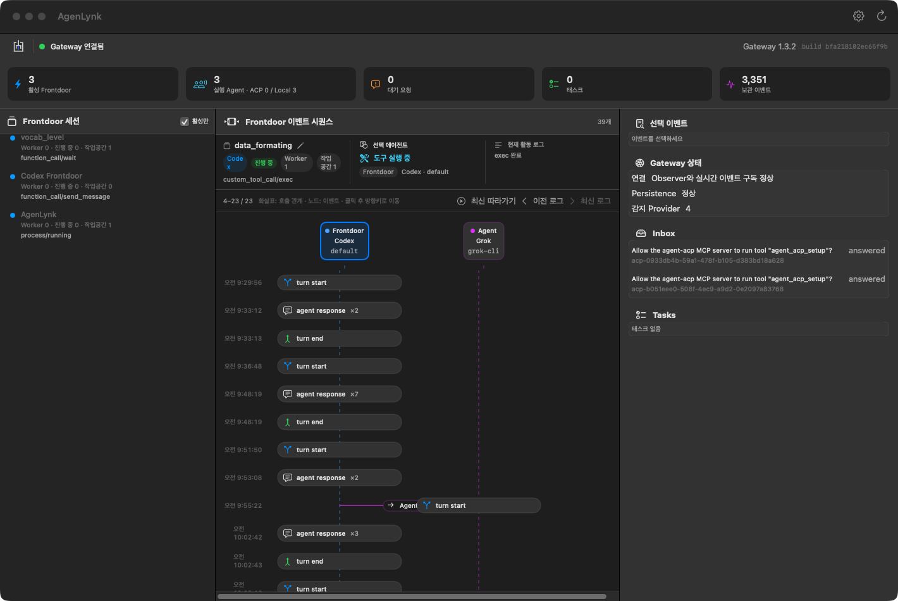
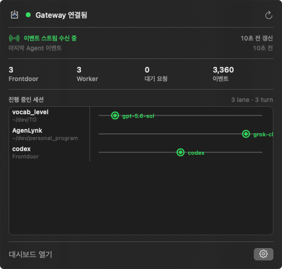
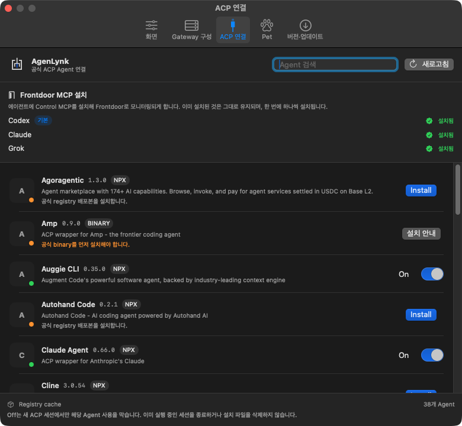

<p align="center">
  
</p>

<h1 align="center">AgenLynk</h1>

<p align="center">
  <b>0.4.0 beta</b> · Apache-2.0 · macOS 14+ · Apple Silicon
</p>

<p align="center">
  여러 에이전트에게 일을 나누다 보면, 누가 무엇을 하고 있는지 놓치기 쉽습니다.<br/>
  AgenLynk는 그 흐름을 메뉴바와 한 화면에서 보여 줍니다.
</p>

<p align="center">
  
  
  
</p>

<p align="center">
  
</p>

## 사용 방법

[Releases](https://github.com/creverse-ai-lab/agenlynk/releases)에서 `AgenLynk.dmg`를 받아 `AgenLynk.app`을 **Applications**로 옮긴 뒤 실행합니다. 시스템에 Node를 따로 설치할 필요는 없습니다.

처음 실행하면 대시보드 대신 설치 화면이 열립니다. 대화에 쓸 에이전트(Codex / Claude / Grok)를 하나 이상 고르면, 앱이 포함된 Gateway 런타임을 설치하고 모니터링을 시작합니다. 서명은 ad-hoc이므로 다른 Mac에서는 `우클릭 → 열기`로 실행하세요.

그다음부터는 화면이 하는 일이 전부입니다.

1. **메뉴바 아이콘**  
   에이전트가 진행 중인지, 응답을 기다리는지 창을 열지 않고 확인합니다. `대시보드 열기`로 전체 화면으로 들어갑니다.

   <p align="center">
     
   </p>

2. **왼쪽 — Frontdoor 세션**  
   지금 떠 있는 대화 세션 목록입니다. 하나를 고르면 가운데가 그 작업만 보여 줍니다.
3. **가운데 — 시퀀스 다이어그램**  
   Frontdoor에서 Worker로 나간 **호출**과 다시 돌아온 **응답**이 같은 시간축 위에 그려집니다. 아직 돌아오지 않은 호출은 점선으로 남습니다. 선택된 에이전트가 지금 하는 일(도구 실행 중 · 사고 중 · 답변 생성 중 · 권한 대기)이 상태 단어보다 먼저 보입니다.
4. **오른쪽 — 선택 이벤트**  
   클릭한 이벤트의 실제 응답 본문을 먼저 보여 줍니다. 원본 JSON은 접혀 있습니다.
5. **설정**  
   메뉴바 팝오버의 톱니바퀴, 또는 대시보드 툴바의 설정으로 엽니다. 탭이 다섯 개입니다.

## 설정

<p align="center">
  
</p>

혼자 실행 중인 Claude · Codex · Grok 세션은 MCP 없이도 보입니다.  
한 에이전트가 다른 에이전트에게 일을 넘긴 관계까지 보려면 **ACP 연결**에서 Frontdoor MCP를 추가하세요.

### 화면

대시보드에 무엇을 그릴지 정합니다.

- **활성 세션만 표시** — 끝난 세션을 목록에서 숨깁니다.
- **AI thought 표시** / **Tool call 표시** — 시퀀스에 사고 과정과 도구 호출을 넣을지 고릅니다. 끄면 호출·응답만 남습니다.
- **Observer 다시 연결** — 모니터만 다시 붙입니다. Gateway나 실행 중인 에이전트는 멈추지 않습니다.
- Node 경로는 비워 두면 됩니다. 앱이 포함한 Node를 씁니다.

### Gateway 구성

Gateway가 세션을 얼마나 남기고, 자원을 얼마나 쓸지 정합니다. 값은 밀리초가 아니라 일·시간·분 단위로 입력합니다.

- **변경 저장** — 값을 기록만 합니다. 아직 적용되지 않은 항목은 `재시작 대기`로 표시됩니다.
- **적용 및 안전 재시작** — 저장한 값을 실제로 켭니다. 진행 중인 세션·Task·미응답 요청이 있으면 재시작이 막힙니다.
- 보존 기간을 줄이면 오래된 기록이 삭제됩니다. 그 경우 확인 창이 뜹니다. 진행 중이거나 고정(pinned)한 세션은 지우지 않습니다.
- `ENV`로 표시된 항목은 환경변수로 잠겨 있어 여기서 바꿀 수 없습니다.

나머지 값은 기본값으로 두면 됩니다. 다만 이 탭 **맨 아래**의 **서브에이전트 대화 기록**은 영향이 큽니다.

- 기본값은 꺼져 있습니다. 꺼 두면 Claude Worker가 안에서 띄운 Task 서브에이전트의 대화는 모으지 않습니다. Worker가 돌려준 결과는 그대로 보입니다.
- 켜면 그 서브에이전트의 메시지, 도구 호출, 사고 과정까지 시퀀스에 들어옵니다. 위임 한 건당 이벤트가 크게 늘어나므로, 안쪽 대화까지 봐야 할 때만 켜세요.
- 다른 Gateway 설정과 같이 **적용 및 안전 재시작** 뒤에 반영됩니다.

### ACP 연결

에이전트를 Gateway에 붙이는 화면입니다. 설정에서 가장 자주 쓰는 탭입니다.

- **Frontdoor MCP 설치** — Codex / Claude / Grok에 Control MCP를 넣습니다. 이 에이전트가 다른 에이전트에게 일을 넘기는 것을 추적하려면 여기가 필요합니다. 이미 된 것은 `설치됨`입니다. 처음 설치에서 고른 것은 `기본`으로 표시됩니다.
- 아래 목록은 공식 ACP registry의 Worker입니다. `Install`로 추가하고, 스위치로 On/Off 합니다.
- **Off**는 새 세션에서만 그 에이전트를 막습니다. 이미 돌아가는 작업은 끊지 않고, 설치 파일도 지우지 않습니다.
- 업데이트가 있으면 해당 줄에 `업데이트`가 나타납니다.

### Pet

데스크톱에 상태 오버레이를 띄웁니다.

- **Agent status pet 사용**을 켜면 기본 Pet이 뜹니다.
- 경로를 비워 두면 앱에 들어 있는 Pet을 씁니다. 다른 실행 파일을 지정할 수도 있습니다.
- Pet은 읽기만 합니다. 여기서 에이전트를 설치하거나 끄지 않습니다.

### 버전·업데이트

앱, Gateway 런타임, ACP 어댑터를 각각 비교합니다.

- **AgenLynk 앱** — 새 버전이 있으면 `다운로드`로 DMG를 받습니다. Applications의 앱을 교체하세요.
- **Gateway 런타임** — 지금 쓰는 런타임이 이 앱에 들어 있는 것보다 오래됐으면 `이 앱의 runtime 설치 및 적용`으로 올립니다. 더 오래된 쪽으로는 자동으로 내려가지 않습니다.
- **ACP 어댑터** — 여기에서는 개수만 보여 줍니다. 실제 업데이트는 **ACP 연결** 탭에서 합니다.
- **이전 버전으로 롤백**은 바로 전에 쓰던 런타임이 남아 있을 때만 켜집니다.

## 이 앱이 하는 일

AgenLynk는 Claude, Codex, Grok 같은 **로컬 AI 에이전트를 하나로 묶는 오픈소스 macOS 앱**입니다. 이미 사용 중인 에이전트를 연결하고, 한 에이전트가 다른 에이전트에게 일을 위임하는 과정까지 실행·모니터링합니다.

코드를 새로 짜는 멀티 에이전트 프레임워크가 아닙니다. 로컬에서 여러 에이전트를 오케스트레이션하는 데스크톱 앱이며, 그 안에 **ACP Gateway** 런타임이 함께 들어 있습니다.

AgenLynk is an open-source macOS app that ties multiple local AI agents together — Claude, Codex, and Grok — including delegated work from one agent to another. It is not a coding framework. It is a local multi-agent gateway with a live monitor.

로컬 한 대의 Mac, 한 명의 사용자를 기준으로 합니다.

---

## 소스에서 빌드

```bash
git clone https://github.com/creverse-ai-lab/agenlynk.git
cd agenlynk
npm ci

npm run macos:build && npm run macos:run   # 개발용 (시스템 Node)
npm run macos:dmg                          # 배포용 DMG
npm run macos:verify                       # 서명·런타임·번들 Node 검증
```

개발 세부와 Gateway CLI 단독 운영은 [`macos/README.md`](macos/README.md)를 참고하세요.

### 테스트

```bash
npm test              # 전체 회귀 (Node) — release gate
npm run test:quick    # 일상 개발용
npm run macos:test    # Swift 모델·설정·Pet·온보딩
```

앱 UI는 SwiftUI(`macos/Sources/`), Monitor sidecar는 Node(`sidecar/`)입니다. DMG는 `gateway.lock.json`에 고정된 Gateway 1.4.0 artifact와 Node를 `Contents/Resources/gateway-seed/`에, 앱과 함께 움직이는 sidecar를 `Contents/Resources/sidecar/`에 담습니다. 소스 트리에서 Gateway를 쓰려면 `npm run gateway:fetch` 또는 `ACP_LYNK_GATEWAY_DEVELOPMENT_ROOT`를 사용하세요.

## 버전

| 버전 | 주요 내용 |
|---|---|
| **0.4.0** | 공식 Gateway 1.4.0 artifact를 고정해 사용 · 앱 / Gateway / 어댑터 업데이트 확인 |
| **0.3.5** | 시퀀스 다이어그램 방향키 스크롤 |
| **0.3.4** | Frontdoor 설치 상태를 실제 에이전트 config로 감지 · 온보딩 다중 설치 |
| **0.3.3** | Frontdoor 이름 지정 · 시퀀스 다이어그램 호출/응답 화살표 · 선택 에이전트 활동 |
| **0.2.0** | AgenLynk로 리네임 · Pet Canvas 렌더 · DMG 경량화 |

## 라이선스

AgenLynk는 [Apache License 2.0](LICENSE)으로 배포합니다.  
앱에 포함되는 ACP Gateway 런타임은 [agent_gateway](https://github.com/creverse-ai-lab/agent_gateway)의 라이선스를 따릅니다. 번들 Node.js는 MIT입니다.

## Credits

| 역할 | 이름 |
|---|---|
| **Dev** | 윤치영 (feat. Fable / Opus) |
| **App Icon** | 이희주 (feat. 디자이너리) |
| **App Name** | 김은경 (feat. Luna) |
