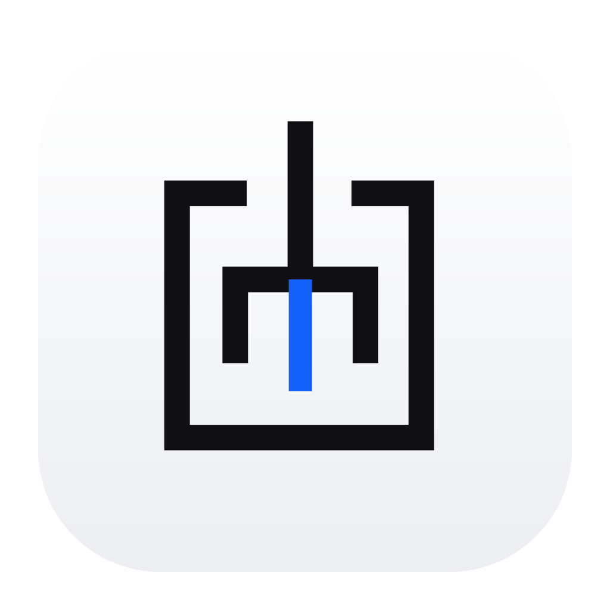
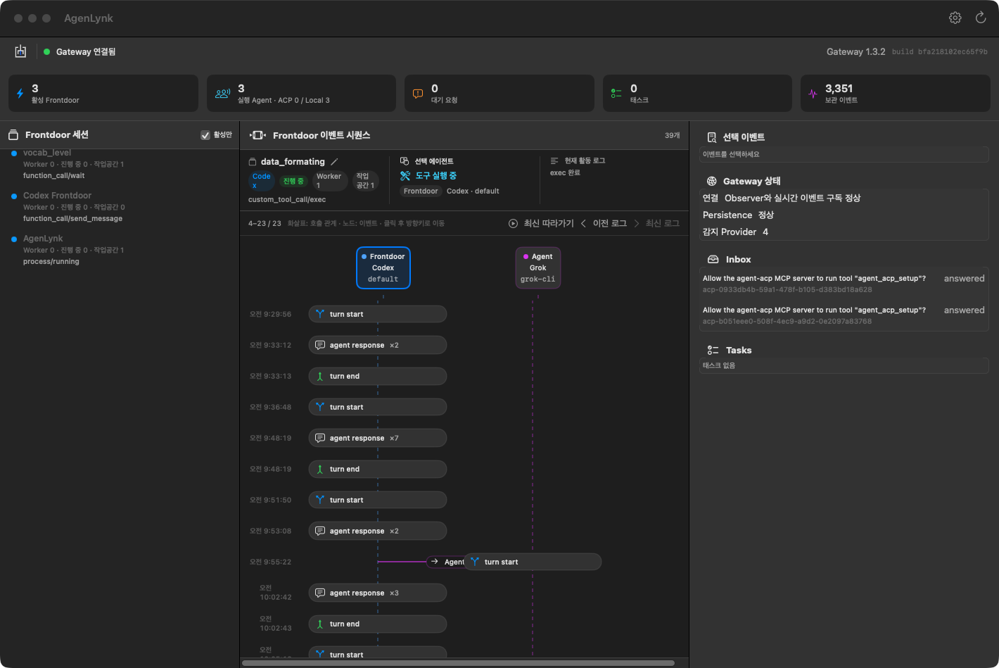
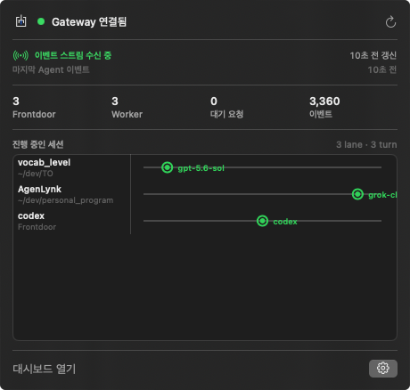
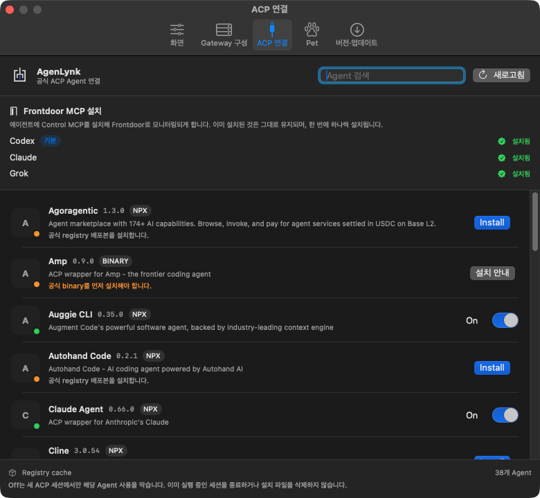

<p align="center">
  
</p>

<h1 align="center">AgenLynk</h1>

<p align="center">
  <b>0.5.0 beta 1</b> · Apache-2.0 · macOS 14+ · Apple Silicon
</p>

<p align="center">
  여러 에이전트에게 일을 나누다 보면, 누가 무엇을 하고 있는지 놓치기 쉽습니다.<br/>
  AgenLynk는 그 흐름을 메뉴바와 한 화면에서 보여 줍니다.
</p>

<p align="center">
  
  
  
</p>

<p align="center">
  
</p>

## 사용 방법

[Releases](https://github.com/creverse-ai-lab/agenlynk/releases)에서 `AgenLynk.dmg`를 받아 `AgenLynk.app`을 **Applications**로 옮긴 뒤 실행합니다. 시스템에 Node를 따로 설치할 필요는 없습니다.

처음 실행하면 대시보드 대신 설치 화면이 열립니다. 대화에 쓸 에이전트(Codex / Claude / Grok)를 하나 이상 고르면, 앱이 포함된 Gateway 런타임을 설치하고 모니터링을 시작합니다. 서명은 ad-hoc이므로 다른 Mac에서는 `우클릭 → 열기`로 실행하세요.

그다음부터는 화면이 하는 일이 전부입니다.

1. **메뉴바 아이콘**  
   아이콘 옆에 `메인 | 서브` 개수가 숫자로 보입니다. `2 | 5`는 작업 중인 Frontdoor 2개, 그 아래서 움직이는 Worker 5개입니다. 사용자를 기다리는 단계가 있으면 `2 | 5 · 권한 1`처럼 뒤에 붙습니다. 누르면 작업마다 **파이프라인 카드**가 나옵니다.
   - 카드 한 장이 Frontdoor 하나의 작업이고, `Frontdoor → Worker → 하위 Worker`가 들여쓰기로 이어집니다. 단계마다 아이콘, 이름, 상태(실행 중 · 권한 대기 · 입력 대기 · 대기 · 종료 · 오류)와 경과 시간이 붙습니다.
   - 사용자가 해야 할 일이 있는 작업이 맨 위에 오고, 그 단계에 `← 현재`와 대기 이유(예: 승인할 명령)가 표시됩니다. 카드 아래에는 지금 하는 일과 `이번 턴 토큰 / 예상`이 나옵니다.
   - 카드에는 Frontdoor와 움직이는 Worker(실행 중 · 권한/입력 대기 · 오류)만 나열되고, 쉬고 있는 Worker는 `대기 중 Worker N개` 상자로 셉니다.
   - 카드나 단계를 누르면 그 작업·세션이 선택된 대시보드가 열립니다. 대기 중인 작업은 `대기 중 작업 N개`로 접혀 있습니다.

   <p align="center">
     
   </p>

2. **왼쪽 — Frontdoor 세션**  
   지금 떠 있는 대화 세션 목록입니다. 하나를 고르면 가운데가 그 작업만 보여 줍니다. Worker는 늘 자기 Frontdoor 아래에 묶이고, 셸에서 띄운 `claude -p` · `grok -p` · `codex exec`와 2~3단 서브에이전트도 띄운 세션의 Worker로 연결됩니다. `지난 기록`도 Frontdoor 한 줄 = 작업 하나로 묶입니다.
3. **가운데 — 현황 / 그래프 / 시퀀스**  
   위쪽 전환 버튼으로 고릅니다. 선택한 세션은 세 보기에서 같이 유지됩니다.
   - **현황**: 작업마다 카드 한 장. 메뉴바 카드와 같은 내용에 토큰과 현재 단계가 붙습니다.
   - **그래프**: Frontdoor → Worker → 하위 Worker를 왼쪽에서 오른쪽으로 그린 정적인 트리. 움직이지 않고, 40개 노드까지 겹치지 않습니다.
   - **시퀀스**: Frontdoor에서 Worker로 나간 **호출**과 다시 돌아온 **응답**이 같은 시간축 위에 그려집니다. 아직 돌아오지 않은 호출은 점선으로 남습니다. 선택된 에이전트가 지금 하는 일(도구 실행 중 · 사고 중 · 답변 생성 중 · 권한 대기)이 상태 단어보다 먼저 보입니다.
   - 세 보기 모두 쉬고 있는 Worker는 접힌 `대기 중 Worker N개` 상자에 모읍니다. 움직이는 Worker로 이어지는 부모는 남깁니다.
4. **오른쪽 — 선택 이벤트**  
   클릭한 이벤트의 실제 응답 본문을 먼저 보여 줍니다. 원본 JSON은 접혀 있습니다.
5. **설정**  
   메뉴바 팝오버의 톱니바퀴, 또는 대시보드 툴바의 설정으로 엽니다. 탭이 여섯 개입니다.

## 설정

<p align="center">
  
</p>

혼자 실행 중인 Claude · Codex · Grok 세션은 MCP 없이도 보입니다.  
한 에이전트가 다른 에이전트에게 일을 넘긴 관계까지 보려면 **ACP 연결**에서 Frontdoor MCP를 추가하세요.

### 화면

대시보드에 무엇을 그릴지 정합니다.

- **대시보드 보기** — 현황 · 그래프 · 시퀀스 중 보일 보기와 처음 열릴 기본 보기를 고릅니다. 하나는 켜져 있어야 합니다.
- **활성 세션만 표시** — 끝난 세션을 목록에서 숨깁니다.
- **AI thought 표시** / **Tool call 표시** — 시퀀스에 사고 과정과 도구 호출을 넣을지 고릅니다. 끄면 호출·응답만 남습니다.
- **Observer 다시 연결** — 모니터만 다시 붙입니다. Gateway나 실행 중인 에이전트는 멈추지 않습니다.
- Node 경로는 비워 두면 됩니다. 앱이 포함한 Node를 씁니다.

### Gateway 구성

Gateway가 세션을 얼마나 남기고, 자원을 얼마나 쓸지 정합니다. 값은 밀리초가 아니라 일·시간·분 단위로 입력합니다.

- **변경 저장** — 값을 기록만 합니다. 아직 적용되지 않은 항목은 `재시작 대기`로 표시됩니다.
- **적용 및 안전 재시작** — 저장한 값을 실제로 켭니다. 진행 중인 세션·Task·미응답 요청이 있으면 재시작이 막힙니다.
- 보존 기간을 줄이면 오래된 기록이 삭제됩니다. 그 경우 확인 창이 뜹니다. 진행 중이거나 고정(pinned)한 세션은 지우지 않습니다.
- `ENV`로 표시된 항목은 환경변수로 잠겨 있어 여기서 바꿀 수 없습니다.

나머지 값은 기본값으로 두면 됩니다. 다만 이 탭 **맨 아래**의 **서브에이전트 대화 기록**은 영향이 큽니다.

- 기본값은 꺼져 있습니다. 꺼 두면 Claude Worker가 안에서 띄운 Task 서브에이전트의 대화는 모으지 않습니다. Worker가 돌려준 결과는 그대로 보입니다.
- 켜면 그 서브에이전트의 메시지, 도구 호출, 사고 과정까지 시퀀스에 들어옵니다. 위임 한 건당 이벤트가 크게 늘어나므로, 안쪽 대화까지 봐야 할 때만 켜세요.
- 다른 Gateway 설정과 같이 **적용 및 안전 재시작** 뒤에 반영됩니다.

### ACP 연결

에이전트를 Gateway에 붙이는 화면입니다. 설정에서 가장 자주 쓰는 탭입니다.

- **Frontdoor MCP 설치** — Codex / Claude / Grok에 Control MCP를 넣습니다. 이 에이전트가 다른 에이전트에게 일을 넘기는 것을 추적하려면 여기가 필요합니다. 이미 된 것은 `설치됨`입니다. 처음 설치에서 고른 것은 `기본`으로 표시됩니다.
- 아래 목록은 공식 ACP registry의 Worker입니다. `Install`로 추가하고, 스위치로 On/Off 합니다.
- **Off**는 새 세션에서만 그 에이전트를 막습니다. 이미 돌아가는 작업은 끊지 않고, 설치 파일도 지우지 않습니다.
- 업데이트가 있으면 해당 줄에 `업데이트`가 나타납니다.

### 모니터링

Claude · Codex · Grok을 같은 방식으로 실시간 감시하는 hook과 기록을 관리합니다.

- **동의 후에만 설치합니다.** 처음 설치할 때(온보딩) 또는 hook이 추가된 업데이트 뒤 한 번, 어떤 파일(`~/.claude/settings.json`, `~/.codex/hooks.json`, `~/.grok/hooks/agenlynk.json`)이 바뀌는지 보여 주고 CLI별로 고르게 합니다. `사용 안 함`을 고르면 수집 범위가 바뀌기 전까지 다시 묻지 않습니다.
- 다른 도구가 등록한 hook은 건드리지 않고, 바꾸기 전에 원본을 `~/.acp-gateway/agenlynk/backups`에 백업합니다.
- hook은 관찰만 합니다. 에이전트에게 결정을 돌려주지 않고, AgenLynk가 꺼져 있으면 1초 안에 그냥 끝납니다. Codex는 hook 실행마다 한 줄을 출력하므로 꼭 필요한 이벤트(세션 시작, 프롬프트, 권한 요청, 도구 완료, 턴 종료)만 등록합니다.
- hook이 있으면 도구 실행, **권한 대기**(승인됨 / 거부됨 / 취소됨), 턴 종료가 바로 보입니다. 끄면 transcript 감지로 계속 보이지만 권한 대기는 Codex에서만 보입니다. CLI별로 `마지막 수신` 시각이 표시되어 실제로 들어오고 있는지 확인할 수 있습니다.
- **Codex**는 새 hook을 실행하기 전에 승인을 받습니다. `승인 필요`가 보이면 Codex에서 `/hooks`를 열어 승인하세요. AgenLynk가 hook 스크립트를 바꾸면 Codex가 다시 승인을 요청합니다.
- CLI별 스위치로 끄면 다음 업데이트에서도 다시 켜지지 않습니다.

**세션 유지** — 턴을 마친 세션은 바로 사라지지 않고 `대기` 상태로 30분간 목록에 남습니다(다시 쓰면 cold start 없이 이어집니다). 종료가 확인된 세션(SessionEnd, 프로세스 종료)은 바로 기록으로 옮겨집니다. 시간은 **Gateway 구성 > 로컬 모니터링 > 대기 세션 유지 시간**에서 바꿉니다.

**기록** — 세션 타임라인(프롬프트, 도구 입력·출력 포함)은 `~/.acp-gateway/agenlynk/monitor.db`에 기본 14일 보관되고, 대시보드의 `지난 기록`에서 스크롤로 계속 불러볼 수 있습니다. 보관 기간은 **Gateway 구성 > 로컬 모니터링 > 모니터 기록 보관 기간**에서 바꾸며 0이면 디스크에 남기지 않습니다. 이 탭에서 용량을 확인하고 `기록 지금 삭제`로 지울 수 있습니다.

토큰 사용량은 세 CLI 모두 같은 기준(입력은 cache 포함, 합계 = 입력 + 출력)의 **세션 누적**이고, 컨텍스트는 **최근 요청**의 크기입니다.

### Pet

데스크톱에 상태 오버레이를 띄웁니다.

- **Agent status pet 사용**을 켜면 기본 Pet이 뜹니다.
- 경로를 비워 두면 앱에 들어 있는 Pet을 씁니다. 다른 실행 파일을 지정할 수도 있습니다.
- 커서를 잠시 멈추면 Pet이 제자리에 서고, 노드에 마우스를 올리면 이름 · 역할 · 상태 · CLI · 작업이 말풍선으로 보입니다. 클릭은 가로채지 않습니다.
- Pet은 읽기만 합니다. 여기서 에이전트를 설치하거나 끄지 않습니다.

### 버전·업데이트

앱, Gateway 런타임, ACP 어댑터를 각각 비교합니다.

- **AgenLynk 앱** — 새 버전이 있으면 `다운로드`로 DMG를 받습니다. Applications의 앱을 교체하세요.
- **Gateway 런타임** — 지금 쓰는 런타임이 이 앱에 들어 있는 것보다 오래됐으면 `이 앱의 runtime 설치 및 적용`으로 올립니다. 더 오래된 쪽으로는 자동으로 내려가지 않습니다.
- **ACP 어댑터** — 여기에서는 개수만 보여 줍니다. 실제 업데이트는 **ACP 연결** 탭에서 합니다.
- **이전 버전으로 롤백**은 바로 전에 쓰던 런타임이 남아 있을 때만 켜집니다.

## 이 앱이 하는 일

AgenLynk는 Claude, Codex, Grok 같은 **로컬 AI 에이전트를 하나로 묶는 오픈소스 macOS 앱**입니다. 이미 사용 중인 에이전트를 연결하고, 한 에이전트가 다른 에이전트에게 일을 위임하는 과정까지 실행·모니터링합니다.

코드를 새로 짜는 멀티 에이전트 프레임워크가 아닙니다. 로컬에서 여러 에이전트를 오케스트레이션하는 데스크톱 앱이며, 그 안에 **ACP Gateway** 런타임이 함께 들어 있습니다.

AgenLynk is an open-source macOS app that ties multiple local AI agents together — Claude, Codex, and Grok — including delegated work from one agent to another. It is not a coding framework. It is a local multi-agent gateway with a live monitor.

로컬 한 대의 Mac, 한 명의 사용자를 기준으로 합니다.

---

## 소스에서 빌드

```bash
git clone https://github.com/creverse-ai-lab/agenlynk.git
cd agenlynk
npm ci

npm run macos:build && npm run macos:run   # 개발용 (시스템 Node)
npm run macos:dmg                          # 배포용 DMG
npm run macos:verify                       # 서명·런타임·번들 Node 검증
```

개발 세부와 Gateway CLI 단독 운영은 [`macos/README.md`](macos/README.md)를 참고하세요.

### 테스트

```bash
npm test              # 전체 회귀 (Node) — release gate
npm run test:quick    # 일상 개발용
npm run macos:test    # Swift 모델·설정·Pet·온보딩
```

앱 UI는 SwiftUI(`macos/Sources/`), Monitor sidecar는 Node(`sidecar/`)입니다. DMG는 `gateway.lock.json`에 고정된 Gateway 1.7.2 npm 패키지(`acp-gateway-daemon`, sha512와 npm provenance로 검증)와 Node를 `Contents/Resources/gateway-seed/`에, 앱과 함께 움직이는 sidecar를 `Contents/Resources/sidecar/`에 담습니다. 소스 트리에서 Gateway를 쓰려면 `npm run gateway:fetch` 또는 `ACP_LYNK_GATEWAY_DEVELOPMENT_ROOT`를 사용하세요.

## 버전 및 수정 이력

| 버전 | 주요 내용 |
|---|---|
| **0.6.0 beta 2** | 모찌 마스코트 다듬기: 불투명하고 은은한 입체감의 몸통 · AgenLynk 로고 모양 그대로의 삼지창 · 입 안에 보이는 송곳니와 눈의 반짝임 · 이마에 실제 Claude·Codex·Grok 마크 |
| **0.6.0 beta 1** | 노치 패널(Frontdoor 카드 · 대기 알림 · 끝난 Frontdoor에 답장 · Gateway 채팅) · 에이전트 마스코트와 펫 모양 선택(천체/모찌) · 세션이 실행 중인 창으로 이동 · 메뉴바/노치/펫을 각각 켜고 끄기 · 서브에이전트 Stop을 답장 대기로 붙잡던 문제 등 노치 오류 수정 |
| **0.5.0 beta 4** | AgenLynk가 agent-delegator skill을 직접 배포하고 앱 실행 때마다 최신으로 갱신 · skill을 ACP 호출 방법 중심으로 짧게 정리(모델 지정 규칙 제거) · Worker 작업을 백그라운드로 시작하고 나중에 결과 회수 |
| **0.5.0 beta 3** | Gateway 1.7.2를 npm 패키지로 받음(무결성·출처 검증, runtime 용량 약 418MB → 145MB) · 옛 Gateway에 고정된 MCP 항목 감지와 일괄 다시 연결 · 옛 runtime 정리 · 런타임 업데이트 뒤 옛 daemon 자동 재시작 · Grok Worker가 Codex로 표시되던 문제 등 Worker 연결 오류 수정 |
| **0.5.0 beta 2** | Gateway 1.6.0 호출자 기록으로 Worker를 연 Main을 직접 연결 · 이벤트에 보낸 쪽·받는 쪽(`from`/`to`) 기록 · SDK로 띄운 채팅 호스트 세션을 Frontdoor로 표시 · macOS 26에서 메뉴바 아이콘이 안 보이던 문제 수정 · 앱 시작 즉시 Gateway 연결 |
| **0.5.0 beta 1** | Claude · Codex · Grok 실시간 hook(동의 후 설치) · 세 CLI 공통 이벤트 형식과 SQLite 기록 보관 · 토큰 사용량과 작업 예상치 · 대시보드 현황/그래프/시퀀스 보기와 보기 설정 · 메뉴바 작업 파이프라인과 `메인 \| 서브` 개수 · 셸로 띄운 에이전트와 2~3단 서브에이전트를 Worker로 연결 · 대기 Worker 접기 · Gateway 1.5.2 |
| **0.4.1 beta 2** | 진행 중인 Worker가 별도 Frontdoor로 중복 표시되던 문제 수정 · 턴이 끝나면 Worker가 Frontdoor 그룹에서 떨어지던 문제 수정 · 모니터 재시작 후에도 진행 중 위임 관계 복구 · Claude Task 서브에이전트가 부모 세션 상태를 덮어쓰던 문제 수정 |
| **0.4.1 beta 1** | Codex · Claude · Grok 로컬 세션과 ACP 서브에이전트 감지 개선 · 페이지별 Frontdoor 표시 오류 수정 · 호출/이벤트 캡슐 겹침 수정 · 에이전트 기록 탐색 범위를 필요한 세션 파일로 제한 |
| **0.4.0** | 공식 Gateway 1.4.0 artifact를 고정해 사용 · 앱 / Gateway / 어댑터 업데이트 확인 |
| **0.3.5** | 시퀀스 다이어그램 방향키 스크롤 |
| **0.3.4** | Frontdoor 설치 상태를 실제 에이전트 config로 감지 · 온보딩 다중 설치 |
| **0.3.3** | Frontdoor 이름 지정 · 시퀀스 다이어그램 호출/응답 화살표 · 선택 에이전트 활동 |
| **0.2.0** | AgenLynk로 리네임 · Pet Canvas 렌더 · DMG 경량화 |

### 0.6.0 beta 2 변경 사항

**모찌 마스코트**
- 몸통을 불투명하고 부드러운 쿠션처럼 바꿨습니다. 위에서 빛을 받고, 가장자리로 갈수록 몸통 색의 어두운 톤으로 은은하게 어두워집니다. 예전의 테두리 광택과 반사광은 반투명해 보여서 뺐습니다.
- 들고 있는 창을 AgenLynk 로고 그대로의 삼지창으로 바꿨습니다. 로고를 뒤집어 바깥 테두리를 뺀 모양입니다. 안쪽 괄호가 날, 파란 막대가 창끝, 줄기가 창대가 되고, 끝은 로고처럼 일자로 자릅니다. 예전에는 로고를 세운 채 들고 있어 깃발처럼 보였습니다.
- 송곳니가 작게 벌린 입 안에 보이도록 다시 그렸습니다. 눈에는 반짝임을, 뿔과 이마 배지에는 명암을 넣었습니다.
- 이마 배지에 실제 Claude·Codex(OpenAI)·Grok 마크를 씁니다.

### 0.6.0 beta 1 변경 사항

**노치 패널**
- 노치(노치가 없는 화면은 화면 위쪽)에 패널이 붙습니다. 접혀 있을 때는 가장 급한 Frontdoor의 상태와 대기·진행 개수를, 펼치면 Frontdoor 카드 목록을 보여 줍니다.
- Frontdoor가 사람을 기다리기 시작하면 바로 알림을 띄웁니다. "완료"와 "실패"는 4초 뒤에도 그 상태일 때만 알립니다.
- **답장:** 사람이 모는 Frontdoor가 턴을 끝내면 Stop hook을 20초 붙잡아 두고 답장 창을 띄웁니다. 입력하는 동안 늘어나며 최대 140초입니다. 답장은 같은 대화의 다음 지시로 이어지고, 닫거나 시간이 지나면 평소처럼 멈춥니다. Claude Code와 Grok에서 확인했습니다. Codex는 `/hooks`에서 hook을 다시 신뢰해야 합니다.
- **채팅:** "+"로 Claude·Codex·Grok과 Gateway를 거쳐 대화합니다. 각 CLI의 로그인(구독)을 쓰고, 고른 Frontdoor 밑의 Worker로 열립니다.
- 세션 이름은 처음 시작한 폴더를 따릅니다. 프로세스가 끝난 세션은 바로 목록에서 빠집니다.

**펫과 창 이동**
- 에이전트 마스코트를 추가했습니다. 펫 모양을 천체(로고)와 모찌(캐릭터) 중에서 고릅니다.
- 노치 알림에서 그 세션이 실행 중인 창(Warp, VS Code, Terminal, Claude·Codex 앱)으로 바로 이동합니다.
- 메뉴바, 노치, 노치 알림·소리·답장을 설정에서 각각 켜고 끕니다.

**수정**
- Claude 서브에이전트가 끝날 때의 Stop까지 답장 대기로 붙잡아, 진행 중인 턴이 최대 140초 멈추던 문제를 고쳤습니다.
- 권한을 묻는 채팅 호스트 세션도 노치에서 답장할 수 있습니다.
- 답장이나 권한 응답을 보내지 못하면 답장 창과 권한 카드를 다시 띄웁니다.

### 0.5.0 beta 4 변경 사항

**agent-delegator skill**
- 각 CLI(Claude·Codex·Grok·Auggie)가 읽는 `agent-delegator` skill을 AgenLynk가 직접 배포합니다. 예전에는 Gateway가 처음 설치할 때 한 번 넣고 끝이라, 1.4 시절 안내가 그대로 남아 새 Gateway와 맞지 않았습니다.
- 앱을 실행할 때마다 skill을 앱에 포함된 판으로 갱신합니다. 아무도 고치지 않은 사본만 자동으로 바꾸고, 직접 고친 사본이나 skill이 없는 CLI는 설정 > Frontdoor MCP 설치에서 **업데이트**로 바꿉니다.
- skill 내용을 ACP 호출 방법만 남기고 짧게 줄였습니다(83줄 → 42줄). 어떤 모델을 쓸지는 skill이 정하지 않습니다.

**백그라운드 실행**
- Worker 작업을 `agent_acp_run {waitMs: 0}`으로 시작해 바로 돌려받고, Main은 다른 일을 하다가 `taskId`로 결과를 받습니다.
- Claude Code처럼 백그라운드 서브에이전트가 있는 CLI에서는 대기를 서브에이전트에 맡깁니다. 권한 요청과 질문은 언제나 Main이 답합니다.

### 0.5.0 beta 3 변경 사항

**Gateway 1.7.2를 npm으로**
- 포함된 Gateway를 **1.7.2**로 올리고, GitHub runtime 파일 대신 npm 패키지 `acp-gateway-daemon`으로 받습니다. 패키지는 sha512 무결성과 npm provenance(저장소·workflow·태그·commit)로 검증합니다. Node는 앱이 고정한 버전을 그대로 씁니다.
- runtime 한 버전의 크기가 약 418MB에서 145MB로 줄었습니다. 1.7.2 패키지에는 별도 Claude 실행 파일이 들어 있지 않습니다.
- 기존 MCP 설정이 쓰는 `runtime/current/gateway/...` 경로는 그대로 동작합니다. 1.6 runtime으로 되돌릴 수도 있습니다.
- Gateway 1.7은 Codex가 호출할 때 thread id를 기록합니다. Codex Main이 연 Worker를 그 Codex 세션에 바로 연결합니다.

**runtime과 daemon 관리**
- 런타임을 업데이트한 뒤에도 옛 daemon이 계속 돌던 문제를 고쳤습니다. 진행 중인 작업이 없으면 `shutdown_if_idle`로 새 버전으로 재시작합니다. 1.5 미만 daemon은 자동으로 멈추지 않고, 안전 재시작을 안내합니다.
- 설정 > 버전·업데이트에 **옛 런타임 정리**를 추가했습니다. 지울 버전과 확보할 용량을 먼저 보여 줍니다. 현재 버전, 되돌리기용 이전 버전, MCP 설정이나 실행 중인 프로세스가 아직 쓰는 버전은 남깁니다.

**Frontdoor MCP 설치 점검**
- 에이전트별 control·guide MCP 항목이 어느 runtime을 가리키는지 확인합니다. 옛 버전에 고정됐거나 파일이 없는 항목을 표시하고, **다시 연결** 한 번으로 모든 CLI의 항목을 현재 runtime으로 바꿉니다. Auggie guide도 확인합니다.
- 다시 연결하면 그 항목에 직접 추가한 env 값은 지워집니다.
- 설치 도구 PATH에 `~/.grok/bin`을 넣어 Grok MCP 설치가 `spawn grok ENOENT`로 실패하던 문제를 고쳤습니다.

**Worker 연결 오류 수정**
- 같은 폴더에서 돌던 Codex 밑에 Grok Worker가 붙어 Codex 것으로 표시되던 문제를 고쳤습니다. 폴더가 같다는 이유로 부모를 추정하는 규칙은 Codex 서브에이전트에만 쓰고, Gateway Worker의 근거로는 쓰지 않습니다.
- Gateway 응답에서 Worker의 provider를 그 Worker 자신의 값으로 읽습니다. 목록 응답에서 옆 항목이나 Worker를 연 Main의 provider를 잘못 가져오던 문제를 고쳤습니다.
- Grok 로그에서는 실제 `agent_acp` 도구 결과만 Worker 연결 근거로 씁니다. grep이나 파일 읽기 결과에 Gateway 응답이 인용돼 있어도 더는 Worker를 가져가지 않습니다.

### 0.5.0 beta 2 변경 사항

**Gateway 1.6.0과 호출자 기록**
- 포함된 Gateway를 **1.6.0**으로 올렸습니다. API와 상태 형식은 1.5.2와 같습니다.
- Gateway가 기록한 `openedBy`(세션을 연 Main)로 Worker의 Frontdoor를 정합니다. Main의 transcript를 읽어 추측하던 연결보다 우선합니다.
- Codex는 thread id를 넘기지 않습니다. 같은 Codex thread가 연 Worker 하나가 transcript로 확인되면, 그 thread가 연 나머지 Worker도 같은 Frontdoor에 묶습니다.
- Gateway 턴 이벤트에 보낸 쪽과 받는 쪽을 남깁니다. 턴 시작은 `from`, 턴 끝은 `to`에 그 턴을 시작한 Main이 들어가고, `monitor.db`에도 저장됩니다.
- 1.6.0 이전 Gateway에서는 이전과 같은 transcript 연결을 씁니다.

**Frontdoor / Worker 분류**
- SDK entrypoint(`sdk-*`)로 떴어도 사람이 모는 세션은 Frontdoor로 둡니다. 사람에게 권한을 묻는 채팅 호스트(`--permission-prompt-tool stdio`, 예: Paseo·Conductor·IDE 패널)이거나 프롬프트가 두 번 이상 온 대화가 여기에 해당합니다. 예전에는 `연결 미확인 Worker`로 빠졌습니다.

**앱**
- macOS 26에서 메뉴바 아이콘이 보이지 않던 문제를 고쳤습니다. 시스템이 이전 bundle ID(`ai.creverse.acp-monitor`)를 메뉴바에서 막고 있어서, bundle ID를 `ai.creverse.agenlynk`로 바꿨습니다. 기존 설정은 첫 실행 때 한 번 옮겨 옵니다.
- 새 버전이 처음 실행될 때 사라진 이전 사본(DMG 마운트, 임시 폴더)의 Launch Services 등록을 정리합니다. DMG 빌드·검증 스크립트도 임시 사본의 등록을 남기지 않습니다.
- 대시보드 창이 없어도 앱이 켜지는 즉시 Gateway에 연결합니다.

### 0.5.0 beta 1 변경 사항

**모니터링 파이프라인**
- Claude · Codex · Grok · Gateway에서 오는 기록을 **하나의 이벤트 형식**(Monitor API v2)으로 정규화합니다. 같은 도구 호출이 hook과 transcript에서 함께 와도 한 이벤트로 합쳐집니다.
- 기록을 `~/.acp-gateway/agenlynk/monitor.db`(SQLite, 권한 0600)에 보관합니다. 기본 14일, 세션당 이벤트 상한과 고아 기록 정리가 있습니다.
- **실시간 hook**: 온보딩이나 업데이트 뒤 CLI별 동의를 받은 경우에만 설치합니다. 관찰 전용이고, 다른 도구의 hook은 건드리지 않습니다. 원본은 백업하고 최근 5개만 남깁니다. Codex 신뢰 승인은 자동으로 쓰지 않습니다.
- 세 CLI 공통 기준의 **토큰 사용량**을 보이고, 이번 턴·작업 단위 **예상치**를 계산합니다.

**Frontdoor / Worker 분류**
- 셸에서 띄운 에이전트(`claude -p`, `grok -p`, `codex exec`)는 **프로세스 계보**로 띄운 세션의 Worker가 됩니다. 계보는 부모 프로세스 사슬과 물려받은 세션 id로 찾습니다.
- 2~3단 서브에이전트도 각 CLI의 자체 기록으로 부모를 찾습니다. Claude Task는 transcript, Codex 스폰은 thread DB, Grok은 `subagents/` 기록을 씁니다.
- 동시 32개 실행까지 모두 올바르게 분류되는 것을 확인했습니다.
- 사용량 확인용 프로브처럼 활동 없이 시작과 종료만 있는 세션은 목록에 올리지 않습니다.
- 부모를 끝내 모르는 1회성 실행은 Frontdoor가 아니라 `연결 미확인 Worker`로 묶습니다.
- 화면의 Frontdoor 묶음은 opener id보다 증명된 부모 사슬을 먼저 따릅니다. 한 번 알게 된 부모는 유지합니다.

**화면**
- 대시보드에 **현황 · 그래프 · 시퀀스** 세 보기를 넣었고, 설정에서 보일 보기와 기본 보기를 고릅니다.
- 쉬고 있는 Worker는 모든 보기에서 접힌 `대기 중 Worker N개` 상자로 모입니다.
- 메뉴바를 **작업 파이프라인 카드**로 바꾸고, 아이콘 옆에 `메인 | 서브` 개수를 보입니다.
- `지난 기록`을 Frontdoor 묶음 단위로 바꿔 Worker가 혼자 한 줄로 뜨지 않습니다.
- 시퀀스는 무한 스크롤이 되고, 도구 호출을 헤더로 묶습니다. 세로 점선이 끊기던 문제도 고쳤습니다.
- 좌우 패널을 숨길 수 있고, CLI 아이콘을 표시하며, 세션 이름을 바꿀 수 있습니다.
- 설정의 Frontdoor MCP 설치에서 `가이드 MCP만 설치됨`을 구분해 보입니다. Worker 목록의 켜짐·꺼짐과도 구분됩니다.
- Pet 노드에 마우스를 올리면 세부 정보를 보입니다. 이 정보는 `pet-state`의 선택 필드 `name`, `waitingReason`으로 전달됩니다.

**성능과 안정성**
- 변경 없는 세션은 매초 다시 병합하지 않습니다.
- 스냅샷은 세션당 최근 200건만 싣고, 앱은 스냅샷을 받을 때 기존 이벤트와 병합합니다.
- 원본 도구 출력은 크기 예산 안에서 잘라 보관합니다.
- 앱은 1초 연결 신호에 전체 화면을 다시 그리지 않고, 화면 계산 결과를 캐시합니다.
- 불러온 과거 이벤트는 세션당 5,000건, 과거 세션은 최근 5개까지만 보관합니다.
- `pet.log`는 크기가 커지면 교체합니다.

**Gateway**
- 포함된 Gateway를 **1.5.2**로 올렸습니다. API와 상태 형식은 1.4.0과 호환되고, 1.4.0으로 되돌릴 수 있습니다.

## 라이선스

AgenLynk는 [Apache License 2.0](LICENSE)으로 배포합니다.  
앱에 포함되는 ACP Gateway 런타임은 [agent_gateway](https://github.com/creverse-ai-lab/agent_gateway)의 라이선스를 따릅니다. 번들 Node.js는 MIT입니다.

## Credits

| 역할 | 이름 |
|---|---|
| **Dev** | 윤치영 (feat. Fable / Opus) |
| **App Icon** | 이희주 (feat. 디자이너리) |
| **App Name** | 김은경 (feat. Luna) |
