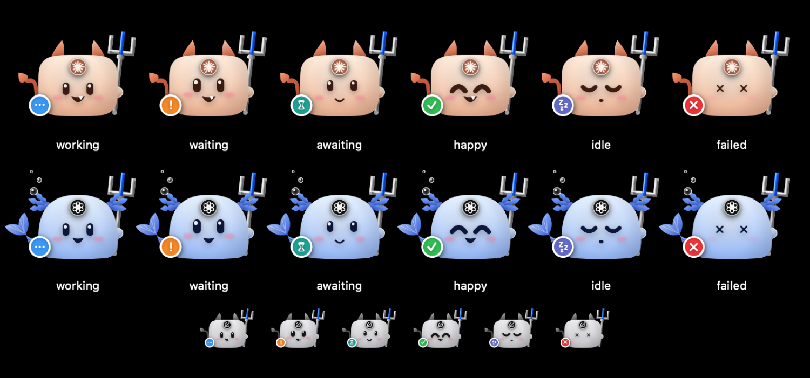

# AgenLynk 사용 가이드

AgenLynk는 Claude · Codex · Grok 같은 로컬 에이전트가 무엇을 하고 있는지 한 곳에서 보여 주는 macOS 앱입니다. 에이전트가 다른 에이전트에게 일을 넘기는 과정(위임)까지 따라갑니다.

이 문서는 설치부터 화면 읽는 법, 상태의 뜻, 업그레이드, 문제 해결까지 순서대로 설명합니다. 빠르게 시작하려면 [1. 설치](#1-설치)와 [3. 상태 읽는 법](#3-상태-읽는-법)만 읽어도 됩니다.

- 대상: AgenLynk 0.6.1 beta 6 이상, Gateway 1.9.0
- 환경: macOS 14 이상, Apple Silicon

## 목차

1. [설치](#1-설치)
2. [용어](#2-용어)
3. [상태 읽는 법](#3-상태-읽는-법)
4. [화면별 사용법](#4-화면별-사용법)
5. [에이전트에게 일 넘기기](#5-에이전트에게-일-넘기기)
6. [설정](#6-설정)
7. [업그레이드](#7-업그레이드)
8. [Control 토큰 관리](#8-control-토큰-관리)
9. [문제 해결](#9-문제-해결)
10. [데이터 위치와 삭제](#10-데이터-위치와-삭제)

---

## 1. 설치

1. [Releases](https://github.com/creverse-ai-lab/agenlynk/releases)에서 `AgenLynk.dmg`를 받습니다.
2. `AgenLynk.app`을 **Applications** 폴더로 옮깁니다. 다른 폴더에서는 설치 단계가 진행되지 않습니다.
3. 실행합니다. ad-hoc 서명이라 처음에는 `우클릭 → 열기`로 열어야 할 수 있습니다.
4. 설치 화면에서 대화에 쓸 에이전트(Codex / Claude / Grok)를 하나 이상 고릅니다.
   - 앱에 들어 있는 Gateway 런타임과 Node가 `~/.acp-gateway/runtime`에 설치됩니다. 시스템에 Node를 따로 설치할 필요는 없습니다.
   - 고른 에이전트에 Control MCP(`agent-acp`)가 등록됩니다. 이 MCP가 있어야 그 에이전트가 다른 에이전트에게 일을 넘길 수 있고, AgenLynk가 그 관계를 그립니다.
5. 모니터링 hook 설치 여부를 CLI별로 고릅니다. hook을 켜면 도구 실행과 권한 대기가 바로 보입니다.

설치가 끝나면 메뉴 막대 아이콘, 노치, 펫이 나타납니다. 열려 있던 에이전트 CLI는 한 번 다시 시작해야 새로 등록된 MCP를 씁니다.

## 2. 용어

| 용어 | 뜻 |
|---|---|
| **Frontdoor** | 사람이 직접 대화하는 에이전트 세션입니다. 터미널에서 띄운 Claude Code, Codex, Grok이 여기에 해당합니다. |
| **Main** | Frontdoor 안에서 일을 지휘하는 쪽입니다. Gateway 문서는 Frontdoor를 Main이라고 부릅니다. |
| **Worker** | Frontdoor가 Gateway를 거쳐 일을 맡긴 에이전트 세션입니다. Worker가 다시 하위 Worker를 둘 수 있습니다. |
| **Gateway** | Frontdoor와 Worker 사이를 잇는 로컬 데몬(ACP Gateway)입니다. AgenLynk에 들어 있습니다. |
| **턴** | 에이전트가 요청 하나를 받아 답을 마칠 때까지의 한 번의 작업입니다. |

## 3. 상태 읽는 법

노치, 메뉴 막대, 대시보드, 펫은 모두 같은 상태 이름을 씁니다.

| 상태 | 노치 표시 | 마스코트 | 뜻 | 할 일 |
|---|---|---|---|---|
| **권한 대기** | 주황 자물쇠 | 통통 뛰며 좌우로 흔듦, `!` 배지 | 에이전트가 명령 실행이나 파일 수정 승인을 기다립니다. | 그 CLI에서 승인하거나 거부합니다. |
| **입력 대기** | 주황 말풍선 | 위와 같음 | 에이전트가 질문에 대한 답을 기다립니다. | 그 CLI에서 답합니다. |
| **오류** | 빨간 표시 | `×` 눈 | 턴이 실패했거나 취소됐습니다. 쓸 수 없는 에이전트도 여기에 들어갑니다. | 대시보드에서 이벤트를 확인합니다. |
| **Worker 대기** | 청록 모래시계 | 위쪽(Worker 쪽)을 보는 눈, 다문 미소, 모래시계 배지, 느린 흔들림 | Main이 자기 Worker의 결과를 기다리며 잠들어 있습니다. 사람을 기다리는 것도, 쉬는 것도 아닙니다. | 할 일 없습니다. Worker가 끝나거나 응답이 필요하면 Main이 바로 깨어납니다. |
| **작업 중** | 파란 망치 | 위아래로 움직임, `…` 배지 | 도구를 실행하고 있습니다. | 없음 |
| **생각 중** | 보라 반짝임 | 위와 같음 | 도구 없이 생각하거나 답을 쓰고 있습니다. | 없음 |
| **완료** | 초록 체크 | 웃는 눈, 체크 배지 | 턴을 막 마쳤습니다. 3분 동안 이렇게 보인 뒤 **쉬는 중**으로 바뀝니다. | 결과를 확인합니다. |
| **쉬는 중** | zzz | 감은 눈, zzz 배지 | 다음 요청을 기다립니다. | 없음 |
| **종료됨** | 전원 표시 | 회색 | 세션이 끝났습니다. | 없음 |
| **답장 대기** | 청록 화살표 | — | 노치에서 답장을 받으려고 Frontdoor가 잠시 기다립니다. ([4.2](#42-노치) 참고) | 답장하거나 그냥 둡니다. |

<p align="center">
  
</p>

여러 상태가 겹치면 더 급한 쪽이 먼저 보입니다. 순서는 **권한·입력 대기 → 오류 → Worker 대기 → 작업 중 → 완료 → 쉬는 중**입니다.

- Main이 Worker를 기다리는 동안 그 Worker가 권한을 기다리면, 카드에는 **권한 대기**가 먼저 보입니다.
- **Worker 대기**와 **작업 중**은 진행 중인 작업으로 셉니다. 카드가 접히지 않고 위쪽에 남습니다.
- **Worker 대기**는 Gateway 1.9.0부터 보입니다. 그 Frontdoor가 1.9.0 front door와 새 위임 스킬을 써야 합니다. 업그레이드 뒤 CLI를 다시 시작하지 않았다면 보이지 않습니다. ([7. 업그레이드](#7-업그레이드) 참고)

## 4. 화면별 사용법

### 4.1 메뉴 막대

- 아이콘 옆 숫자 `2 | 5`는 작업 중인 Frontdoor 2개, 그 아래에서 움직이는 Worker 5개입니다. 사용자를 기다리는 단계가 있으면 `2 | 5 · 권한 1`처럼 붙습니다.
- 누르면 Frontdoor마다 파이프라인 카드가 나옵니다. `Frontdoor → Worker → 하위 Worker`가 들여쓰기로 이어지고, 단계마다 상태와 경과 시간이 붙습니다.
- 사용자를 기다리는 작업이 맨 위에 오고, 그 단계에 `← 현재`와 대기 이유가 표시됩니다.
- 쉬고 있는 Worker는 `대기 중 Worker N개` 상자로 접힙니다.
- 카드를 누르면 그 작업이 선택된 대시보드가 열립니다.

### 4.2 노치

노치가 있는 Mac은 노치 주변에, 노치가 없는 화면에서는 상단 가운데에 나타납니다.

**접힌 상태**
- 가장 급한 Frontdoor의 마스코트와 상태 아이콘이 보입니다.
- 오른쪽에 사용자를 기다리는 수와 `작업 중 Frontdoor / Worker` 수가 보입니다.

**펼친 상태** (누르면 펼쳐지고, Esc로 닫힙니다)
- Frontdoor마다 카드가 나옵니다. 카드에는 마스코트, 상태, 실행 중인 Worker 수가 보입니다.
- 창 모양 버튼을 누르면 그 세션이 실행 중인 터미널 창으로 바로 이동합니다.
- `i` 버튼은 세션 상세를 엽니다.
- 쉬고 있는 Frontdoor는 아래쪽 **쉬는 중**에 모입니다.
- `+` 버튼으로 노치에서 바로 에이전트와 채팅할 수 있습니다. 채팅은 Gateway Worker로 실행되고, 고른 Frontdoor 아래에 붙습니다.

**알림**
- 권한·입력 대기, 작업 완료·실패를 노치에서 알립니다.
- 일반 알림은 5초 뒤 사라집니다. 사람의 응답이 필요한 알림은 답할 때까지 남습니다.
- 알림의 마스코트는 처음 5초만 움직이고 그 뒤에는 멈춥니다. CPU를 아끼기 위해서입니다.

**노치에서 답장하기**
- **표시 요소 > 끝난 Frontdoor에 노치에서 답장**을 켜면, 사람이 쓰는 Frontdoor가 턴을 마칠 때 노치에 답장 상자가 뜹니다.
- 답장을 보내면 그 Frontdoor가 바로 이어서 일합니다.
- 기다리는 시간은 최대 20초, 입력 중이면 최대 140초입니다. 그동안 터미널 입력은 기다림이 끝난 뒤 처리됩니다.

### 4.3 대시보드

메뉴 막대 팝오버나 Dock 아이콘으로 엽니다.

- **왼쪽**: Frontdoor 목록입니다. 하나를 고르면 가운데가 그 작업만 보여 줍니다. `지난 기록`에서 끝난 작업도 볼 수 있습니다.
- **가운데**: 세 가지 보기를 위쪽 전환 버튼으로 고릅니다.
  - **현황**: 작업마다 카드 한 장입니다. 메뉴 막대 카드에 토큰과 현재 단계가 더해집니다. 창 이동 버튼도 있습니다.
  - **그래프**: Frontdoor → Worker → 하위 Worker를 왼쪽에서 오른쪽으로 그린 트리입니다.
  - **시퀀스**: Frontdoor에서 Worker로 나간 호출과 돌아온 응답을 시간축 위에 그립니다. 아직 돌아오지 않은 호출은 점선입니다.
- **오른쪽**: 고른 이벤트의 실제 내용입니다. 원본 JSON은 접혀 있습니다.

대시보드를 최소화하거나 다른 창 뒤에 가려 두면, 3초 뒤부터 다시 그리지 않아 CPU를 쓰지 않습니다. 다시 보이면 바로 최신 상태로 그립니다.

### 4.4 펫

데스크톱 위를 떠다니며 세션 상태를 보여 주는 오버레이입니다.

- 모양은 **천체(로고)**, **소악마**, **인어** 중에서 고릅니다. (**설정 > 표시 요소 > 펫 모양**)
- 진행 중인 작업만 크게 보이고, 쉬는 세션은 작게 모입니다.
- 커서를 잠시 멈추면 펫이 제자리에 섭니다. 노드에 마우스를 올리면 이름 · 역할 · 상태 · CLI · 작업이 말풍선으로 보입니다.
- Frontdoor 노드를 누르면 그 세션의 터미널 창으로 이동합니다. 그 밖의 클릭은 아래 앱으로 그대로 전달됩니다.

## 5. 에이전트에게 일 넘기기

Frontdoor에 Control MCP가 등록되어 있으면, 그 에이전트에게 "이 일을 Codex에게 맡겨 줘"처럼 말할 수 있습니다. AgenLynk는 각 CLI에 **agent-delegator** 스킬을 설치해 두고, 에이전트는 이 스킬대로 일합니다.

1. Main이 Worker 세션을 엽니다. (`agent_acp_session_open`)
2. 일을 시작합니다. 결과를 기다리지 않고 곧바로 돌아옵니다. (`agent_acp_run {waitMs: 0}`)
3. 할 일이 남았으면 Main은 다른 일을 계속합니다.
4. 결과가 필요하면 Main은 `agent_acp_wait`에서 잠듭니다. 이 동안 AgenLynk에는 **Worker 대기**로 보입니다.
5. Worker가 끝나거나 승인·답변이 필요해지면 Main이 바로 깨어나 결과를 받거나 요청을 처리합니다.

알아 둘 점:
- Worker가 권한을 요청하면 Main(또는 사람)이 승인합니다. Worker가 스스로 승인하지 않습니다.
- 여러 Worker를 동시에 돌릴 수 있습니다. 세션 하나에는 한 번에 한 턴만 돌아갑니다.
- 스킬은 AgenLynk가 관리합니다. 사용자가 고치지 않은 사본은 앱이 시작할 때 자동으로 최신으로 바뀝니다. 직접 고친 사본은 **설정 > ACP 연결**에서 교체 여부를 고릅니다.

## 6. 설정

메뉴 막대 팝오버의 톱니바퀴, 대시보드 툴바, 또는 `⌘,`로 엽니다.

| 탭 | 하는 일 |
|---|---|
| **화면** | 대시보드에 보일 보기, 활성 세션만 표시, 생각·도구 호출 표시, Observer 다시 연결 |
| **Gateway 구성** | 세션 보존 기간과 자원 한도. **적용 및 안전 재시작**으로 반영합니다. |
| **ACP 연결** | Frontdoor MCP 설치, Worker 어댑터 설치·켜기·끄기, MCP 항목 다시 연결, 위임 스킬 업데이트 |
| **모니터링** | CLI별 hook 켜기·끄기, 마지막 수신 시각, 기록 용량 확인과 삭제 |
| **표시 요소** | 메뉴 막대 · 노치(알림, 소리, 답장) · 펫(모양, 사용자 렌더러) 각각 켜기·끄기 |
| **버전·업데이트** | 앱 · Gateway 런타임 · ACP 어댑터 버전 비교, 런타임 적용과 롤백 |

**ACP 연결 탭의 "다시 연결"**은 다음 경우에 나타납니다.
- MCP 항목이 옛 Gateway 버전에 고정되어 있을 때
- Gateway 1.8 이상인데 항목에 Control 토큰이 남아 있을 때
- 1.8 아래로 되돌렸는데 항목에 토큰이 없을 때

토큰 관련 항목은 앱이 실행될 때 한 번 자동으로 다시 등록합니다. 직접 넣은 env가 있는 항목은 그대로 두고 알려 줍니다. 버튼으로 다시 연결하면 그 항목의 env는 설치기가 쓰는 값으로 바뀝니다.

## 7. 업그레이드

1. 새 `AgenLynk.dmg`를 받아 Applications의 앱을 덮어씁니다. 설정은 그대로 유지됩니다.
2. 앱을 실행합니다. 새 Gateway 런타임은 이때 미리 받아 두지만, 진행 중인 작업이 있을 수 있어 바로 전환하지 않습니다.
3. 진행 중인 Gateway 작업(실행 중인 Worker, 답하지 않은 요청)이 없을 때 **설정 > 버전·업데이트 > 이 앱의 runtime 설치 및 적용**을 누릅니다.
   - 실행 중인 Gateway 데몬은 쉬는 상태가 되면 새 버전으로 자동 재시작됩니다.
   - 문제가 생기면 같은 화면의 **이전 버전으로 롤백**으로 되돌립니다.
4. **열려 있는 Claude · Codex · Grok CLI를 모두 다시 시작합니다.** CLI는 시작할 때 Gateway front door를 띄우므로, 다시 시작해야 새 기능을 씁니다. (예: Gateway 1.9.0의 `agent_acp_wait`와 **Worker 대기** 표시)
5. **설정 > ACP 연결**에 다시 연결 안내나 경고가 있는지 확인합니다.

## 8. Control 토큰 관리

Gateway를 제어하는 권한은 `~/.acp-gateway/install.json`의 Control 토큰으로 확인합니다.

- Gateway 1.8부터 토큰은 에이전트 CLI 설정 파일(`~/.claude.json`, `~/.codex/config.toml`, `~/.grok/config.toml`)에 두지 않습니다. front door가 `install.json`에서 읽습니다.
- AgenLynk가 토큰이 남은 항목을 찾아 다시 등록합니다. ([6. 설정](#6-설정) 참고)
- 예전 설정 백업 파일(`*.bak`)에는 토큰이 남아 있을 수 있습니다. 토큰을 바꾸려면 Gateway가 쉬고 있을 때 터미널에서 실행합니다. 앱이 설치한 런타임으로 실행하므로, 따로 설치한 다른 버전의 Gateway 명령과 섞이지 않습니다.

```bash
RT=~/.acp-gateway/runtime/current
"$RT/node/bin/node" "$RT/gateway/src/admin.js" shutdown_if_idle '{}'
"$RT/node/bin/node" --preserve-symlinks --preserve-symlinks-main "$RT/gateway/src/bootstrap.js" --rotate-token
```

- 첫 명령이 진행 중인 작업 때문에 거절되면, 작업이 끝난 뒤 다시 실행하세요.

- AgenLynk는 바뀐 토큰을 알아채고 스스로 다시 연결합니다.
- 토큰을 바꿨는데 Gateway가 이전 토큰으로 계속 실행 중이면, 작업이 끝난 뒤 **설정 > Gateway 구성**에서 Gateway를 다시 시작하세요.
- 열려 있는 CLI는 다시 시작해야 새 토큰을 씁니다.

## 9. 문제 해결

**Worker 대기가 보이지 않습니다.**
- 그 Frontdoor의 CLI를 Gateway 1.9.0 적용 뒤에 다시 시작했는지 확인하세요. 예전 front door에는 `agent_acp_wait`가 없습니다.
- **설정 > 버전·업데이트**에서 Gateway 런타임이 1.9.0 이상인지 확인하세요.
- Main이 Worker를 기다리지 않고 다른 일을 하는 동안에는 **작업 중**으로 보이는 것이 맞습니다.

**`claude -p`, `codex exec`로 띄운 세션이 Frontdoor로 보이지 않습니다.**
- 사람이 아닌 자동화 실행은 Frontdoor로 보여 주지 않습니다. 의도된 동작입니다. 이런 세션이 연 Worker는 그 세션 아래에 묶여 보입니다.

**권한 대기가 바로 보이지 않습니다.**
- **설정 > 모니터링**에서 그 CLI의 hook이 켜져 있고 `마지막 수신`이 갱신되는지 확인하세요.
- Codex는 hook을 처음 실행하기 전에 승인을 받습니다. `승인 필요`가 보이면 Codex에서 `/hooks`를 열어 승인하세요.

**상태가 실제와 다르게 보입니다.**
- 노치나 대시보드의 연결 표시가 주황 또는 빨강이면, **설정 > 화면 > Observer 다시 연결**을 누르세요. 실행 중인 에이전트는 멈추지 않습니다.

**CPU를 많이 씁니다.**
- 움직이는 마스코트는 화면을 계속 다시 그립니다. 펼친 노치의 카드 마스코트, 작업 중인 알약 마스코트가 대표적입니다.
- 필요 없으면 **설정 > 표시 요소**에서 노치나 펫을 끌 수 있습니다.
- 대시보드는 최소화하거나 가려 두면 다시 그리지 않습니다.

**"설치된 Gateway runtime을 찾지 못했습니다"가 보입니다.**
- 앱이 Applications 폴더에 있는지 확인하고 다시 실행하세요. 계속되면 설치 화면의 안내에 따라 런타임을 복구합니다.

**MCP 항목 경고가 사라지지 않습니다.**
- **설정 > ACP 연결**의 경고 문구를 확인하세요. "소유 기록 이전에 등록된 항목"이면 **다시 연결**을 한 번 누르면 이후부터 자동으로 관리됩니다.

## 10. 데이터 위치와 삭제

| 위치 | 내용 |
|---|---|
| `~/.acp-gateway/install.json` | Gateway identity(Control 토큰)와 설치 기록 |
| `~/.acp-gateway/runtime/` | Gateway 런타임 버전들. 옛 버전은 **설정 > 버전·업데이트**에서 정리합니다. |
| `~/.acp-gateway/agenlynk/monitor.db` | 세션 타임라인 기록(기본 14일). **설정 > 모니터링**에서 지웁니다. |
| `~/.acp-gateway/agenlynk/backups/` | hook을 바꾸기 전에 만든 설정 백업 |
| `~/Library/Application Support/ACPMonitor/` | 펫 상태 파일(`pet-state.json`, `pet-actions.json`) |

AgenLynk를 지우려면 앱을 종료하고 Applications에서 `AgenLynk.app`을 삭제합니다. Gateway와 기록까지 지우려면 위 폴더도 삭제하세요. 다른 도구가 Gateway를 쓰고 있다면 `~/.acp-gateway`는 남겨 두세요.
